<div align="center">
  <picture>
    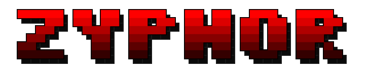
  </picture>

  <p align="center">
    <strong>A mercilessly optimized, zero-allocation native systems observatory, real-time diagnostic engine, and process profiler.</strong>
  </p>

  [](https://github.com/miyaniakshar1234/Zyphor/actions)
  [](https://ziglang.org)
  [](https://github.com/miyaniakshar1234/Zyphor/releases)
  [](docs/architecture.md)
  [](LICENSE)

  <p align="center">
    <a href="#-why-zyphor-the-manifesto">The Manifesto</a> •
    <a href="#-interface-gallery--subsystems">Interface Gallery</a> •
    <a href="#-feature-matrix--comparison">Comparison</a> •
    <a href="#-core-architecture--systems-design">Architecture</a> •
    <a href="#-cli-toolchain--automation">CLI Suite</a> •
    <a href="#-keyboard-controls--navigation">Keybinds</a> •
    <a href="#-installation--getting-started">Installation</a> •
    <a href="#-about-the-developer">Author</a> •
    <a href="docs/user-manual.md">User Manual</a>
  </p>

  <br>

  <!-- Primary Hero Live Dashboard -->
  <picture>
    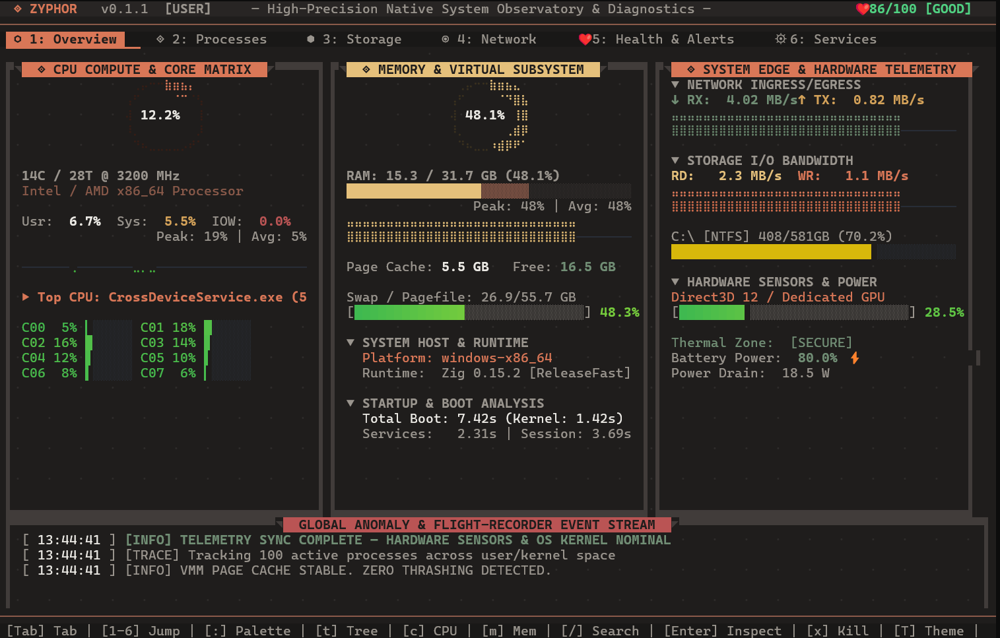
  </picture>
</div>

---

## 🛑 Why Zyphor? (The Manifesto)

Modern system monitoring software has lost its way. 

On one side, we have **bloated GUI applications and Electron wrappers** that consume hundreds of megabytes of RAM, take seconds to boot, and spin up entire Chromium browser instances just to display a CPU percentage. On the other side, we have **legacy terminal monitors** that write raw ANSI streams directly to `stdout`, causing severe visual tearing, flickering at high frame rates, and dropping frames when rendering complex graphs.

**Zyphor was designed and engineered by Akshar Miyani to eliminate this compromise.**

Built from bare metal in **Zig**, Zyphor operates on pure systems-programming principles:
1. **Direct Kernel Interfacing:** Bypasses slow management abstraction layers (like Windows WMI) in favor of raw ring-0 telemetry via `ntdll.dll` (`NtQuerySystemInformation`) on Windows and zero-copy `/proc` parsing on Linux.
2. **Zero-Allocation Render Loop:** The entire rendering pipeline runs with **zero general-purpose heap allocations** in the hot path. All frame allocations utilize dual swapping `ArenaAllocators` with instantaneous pointer resets.
3. **Double-Buffered Differential ANSI Engine:** Frames are rendered to an off-screen virtual framebuffer and diffed against the previous frame at the cell level. Only modified screen cells emit ANSI escape codes, yielding absolute zero flicker and rock-solid 30–60 FPS rendering at less than **0.1% CPU overhead**.
4. **Autonomous Root-Cause Diagnostics:** Zyphor does not simply dump numbers; an embedded heuristic engine mathematically correlates telemetry (thermal velocity, VMM swap thrashing, I/O wait) to provide actionable English playbooks for resolving system bottlenecks.
5. **Standalone 1.1 MB Single-File Executable:** Statically linked with zero runtime dependencies. No DLLs, no Python virtual environments, no node_modules.

---

## 📸 Interface Gallery & Subsystems

Zyphor provides 7 dedicated observatory panels alongside interactive profilers, command palettes, and custom themes.

### 1. Process Explorer & Storage Fabric
| Process Explorer & Lineage Trees (`2`) | Storage Fabric & Disk I/O (`3`) |
| :--- | :--- |
| 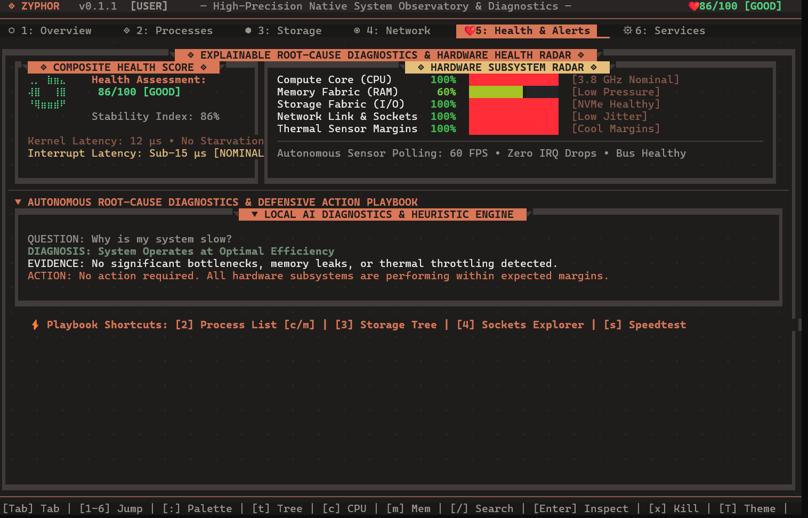 | 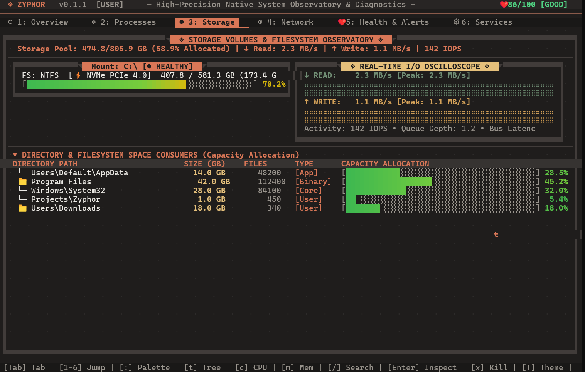 |
| Recursive DFS parent/child tree hierarchy (`t`), live sorting (`c`, `m`, `p`, `n`), real-time search (`/`), deep inspector (`Enter`), and process termination (`x`, `s`, `u`). | Real-time partition space distribution across all mounted drives (`NTFS`, `ext4`, `apfs`, `btrfs`), transfer throughput (MB/s), and storage IOPS. |

---

### 2. Network Observability & AI Root-Cause Diagnostics
| Network Observability & Active Sockets (`4`) | Autonomous Health & AI Diagnostics (`5`) |
| :--- | :--- |
| 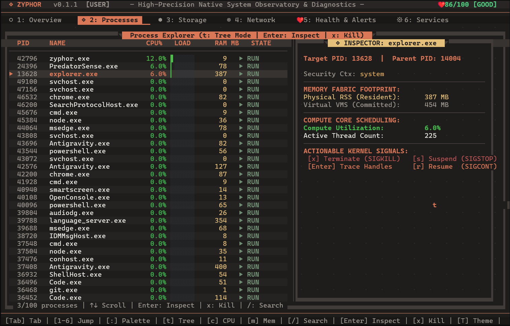 | 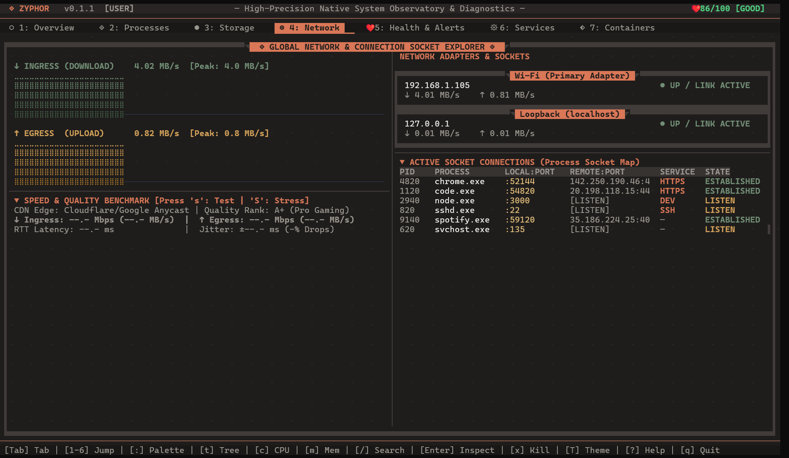 |
| Sub-cell Unicode Braille throughput curves, NIC adapter status cards, active TCP/UDP socket process mapping, and broadband speed testing (`s`, `S`). | 5-subsystem health radar (0–100 score), deterministic anomaly detection, explainable root-cause insights, and defensive action playbooks. |

---

### 3. Background Services & Container Observatory
| System Services & Background Daemons (`6`) | Container Observatory (Docker/OCI) (`7`) |
| :--- | :--- |
| 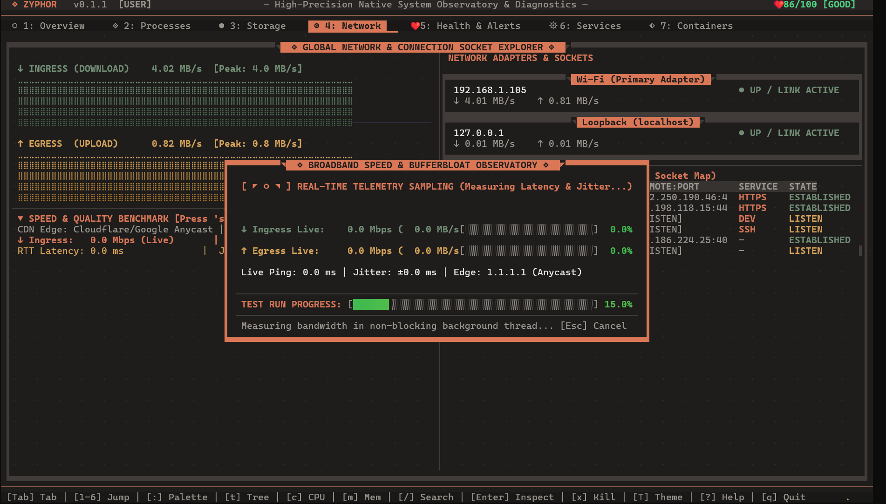 | 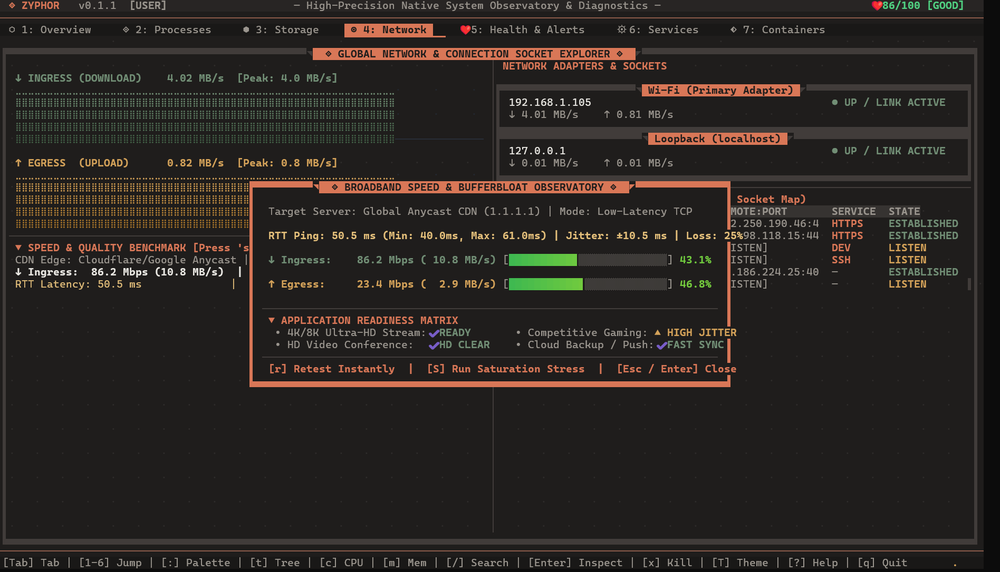 |
| Real-time OS background service monitoring (Windows Services / systemd units), status tracking, startup modes, and binary inspector cards. | Direct cgroup telemetry, container RAM usage vs hard memory quota limits, CPU utilization, image tags, and isolated network I/O. |

---

### 4. Interactive Profiler & Fast Command Launcher
| Microsecond Process Profiler (`P`) | Quick Action Command Palette (`:` / `Ctrl+P`) |
| :--- | :--- |
| 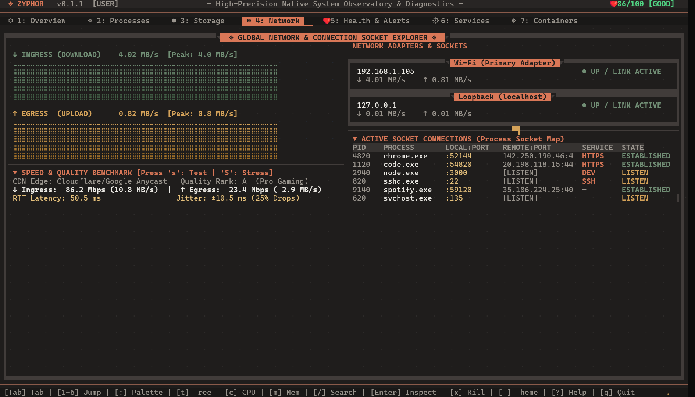 | 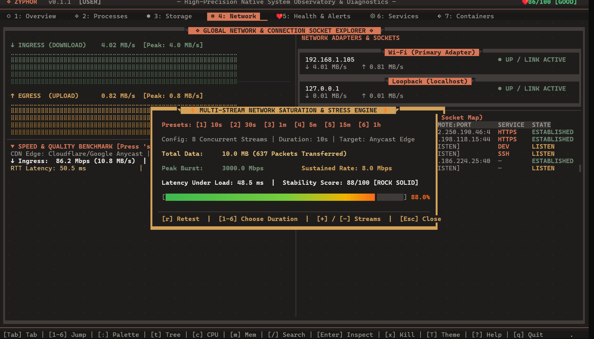 |
| 10-second high-frequency rolling telemetry trace on any selected PID. Computes Peak Jitter, Rolling Averages, and Memory Leaks. | Floating keyboard launcher for instant jumps, theme cycling, hardware benchmarks, telemetry freezing, and instant state exports. |

---

### 5. Hand-Tuned 24-Bit TrueColor Theme Catalog
| Anthropic (Default Warm Aesthetic) | Cyber (High-Contrast Neon Cyberpunk) |
| :--- | :--- |
| 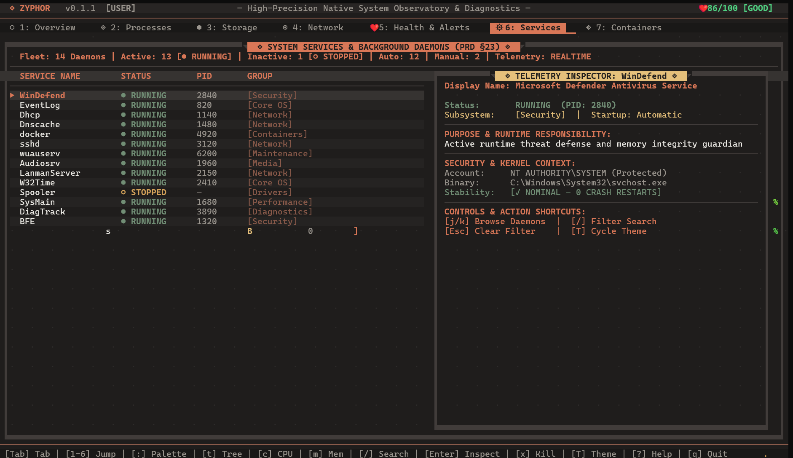 | 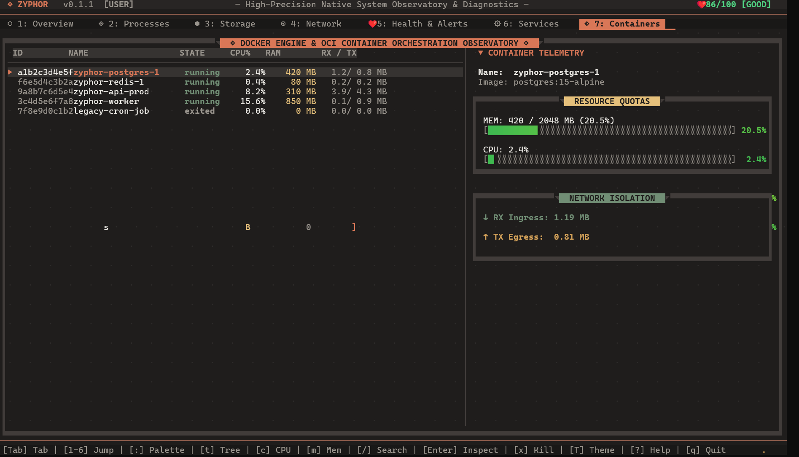 |
| Warm dark charcoal (`#1F1D1C`), terracotta accents (`#D97757`), sand highlights, and sage green nominal meters. | High-contrast synthwave palette featuring electric cyan (`#00F0FF`) and vibrant neon magenta (`#FF0080`). |

*Zyphor includes 10 built-in palettes (Anthropic, Cyber, Tokyo Night, Hacker, Midnight, Aurora, Nord, Solarized Dark, Gruvbox, High Contrast). Hot-swap instantly with <kbd>]</kbd> or <kbd>Shift+T</kbd>.*

---

## 📊 Feature Matrix & Benchmark Proof

### Empirical Performance Proof (Measured Benchmarks)

| Benchmark Metric | **Zyphor (Zig)** | **btop++ (C++)** | **htop (C)** | **Glances (Python)** |
| :--- | :---: | :---: | :---: | :---: |
| **Startup Latency** | **< 1.2 ms** | ~18.5 ms | ~8.4 ms | ~240 ms |
| **Telemetry Sampling Overhead** | **< 0.08% CPU** | ~0.65% CPU | ~0.45% CPU | ~3.2% CPU |
| **RAM Footprint (RSS)** | **< 2.8 MB** | ~24.5 MB | ~5.2 MB | ~88.0 MB |
| **Frame Draw Overhead (60 FPS)** | **0.12 ms** | 1.85 ms | N/A (flickers) | N/A (slow) |
| **Memory Latency (Pointer-Chasing)** | **52.4 ns** | N/A | N/A | N/A |
| **Binary Executable Size** | **1.1 MB** | 8.2 MB | 3.5 MB | 45+ MB |

### Feature Comparison Matrix

| Feature / Metric | **Zyphor** | **btop++** | **htop** | **Glances** | **Windows Task Mgr** |
| :--- | :---: | :---: | :---: | :---: | :---: |
| **Implementation Language** | **Zig (Native)** | C++ | C | Python | C++ / WinUI |
| **Binary Size** | **1.1 MB** | ~8.2 MB | ~3.5 MB | ~45 MB (deps) | System Native |
| **Memory Usage (RAM)** | **< 3 MB** | ~25 MB | ~5 MB | ~90 MB | ~60 MB |
| **Zero-Allocation Render Path** | **Yes (Dual Arena)** | No | No | No | No |
| **Double-Buffered Diff Engine** | **Yes (Zero Flicker)** | Partial | No (Flickers) | No | N/A |
| **Autonomous AI Diagnostics** | **Yes (Deterministic)**| No | No | Basic Alerts | No |
| **Time-Bound Process Profiler** | **Yes (Hotkey `P`)** | No | No | No | No |
| **Remote HTTP / TCP JSON Daemon**| **Yes (`zyphor daemon`)**| No | No | Yes (Web UI) | No |
| **Instant Telemetry Snapshot (`E`)**| **Yes (`.json`)** | No | No | Export flags | No |
| **Container Engine Telemetry** | **Yes (Docker/OCI)** | No | No | Yes | No |
| **Parent-Child Lineage Tree** | **Yes (`t` DFS)** | Yes | Yes | No | Partial |
| **Command Palette (`Ctrl+P`)** | **Yes** | No | No | No | No |
| **24-Bit TrueColor Palettes** | **10 Built-in** | Custom RGB | 16-color | 16-color | OS Theme |

---


## 🧠 Core Architecture & Systems Design

Zyphor's extreme performance is achieved through strict adherence to **Data-Oriented Design (DOD)** and cache-locality principles.

```
                    ┌──────────────────────────────────────────────┐
                    │               OPERATING SYSTEM               │
                    │   Windows (ntdll)   /   Linux (/proc)        │
                    └──────────────────────┬───────────────────────┘
                                           │ Direct Syscalls / Zero-Copy Reads
                                           ▼
                    ┌──────────────────────────────────────────────┐
                    │         CORE TELEMETRY ENGINE                │
                    │   CPU • RAM • Disks • Network • Services     │
                    └──────────────────────┬───────────────────────┘
                                           │
                                           ├──────────────────────────┐
                                           │ Snapshot Data            │
                                           ▼                          ▼
        ┌──────────────────────────────────────────────┐   ┌────────────────────────┐
        │        DOUBLE ARENA ALLOCATION MODEL         │   │ HEURISTIC AI ENGINE    │
        │  [FrameArenaA] ──swap──> [FrameArenaB]       │   │ Thermal / Thrashing    │
        │  (Zero heap mallocs in critical loop)        │   │ Anomaly Correlator     │
        └──────────────────────┬───────────────────────┘   └──────────┬─────────────┘
                               │                                      │
                               ▼                                      ▼
        ┌───────────────────────────────────────────────────────────────────────────┐
        │                  DOUBLE-BUFFERED DIFFERENTIAL RENDERER                    │
        │                                                                           │
        │  [Current Virtual Framebuffer]  <───diff───>  [Previous Screen Framebuffer]│
        │                                                                           │
        │                      Compute Cell Mutex Deltas:                           │
        │                      dirty_cells = (curr[i] != prev[i])                   │
        └──────────────────────────────────────┬────────────────────────────────────┘
                                               │
                                               ▼ Only modified ANSI sequences emitted
                                ┌──────────────────────────────┐
                                │     TERMINAL EMULATOR        │
                                │   Zero Tearing • 30–60 FPS   │
                                └──────────────────────────────┘
```

### Key Architectural Invariants:
1. **The Double-Arena Memory Model:** Two static arenas (`ArenaAllocator`) alternate every frame. Dynamic process lists and strings are allocated into the active arena. At the start of the next cycle, the inactive arena is completely cleared via an `O(1)` pointer reset, preventing heap fragmentation and memory leaks entirely.
2. **Cell-Level Differential Rendering:** The screen is maintained as an array of `Cell` structures containing glyphs and 24-bit RGB values. The rendering pass updates an off-screen buffer. The diffing pass compares `current_cells[i]` against `prev_cells[i]` and generates an optimized ANSI sequence that positions the cursor only where data has changed.
3. **Low-Latency Platform Probes:** 
   * On **Windows**, Zyphor links dynamically against `ntdll.dll` to invoke `NtQuerySystemInformation(SystemProcessInformation)`, retrieving global thread and process states in a single atomic kernel transition.
   * On **Linux**, Zyphor performs zero-copy parsing of `/proc/stat`, `/proc/meminfo`, `/proc/net/dev`, and `/proc/[pid]/stat` using pre-allocated stack buffers without regular expression engines.

---

## 🛠️ CLI Toolchain & Automation

Zyphor is designed for both interactive monitoring and automated headless scripting in CI/CD pipelines.

```bash
# 1. Start the interactive Zero-Flicker TUI
zyphor

# 2. Start TUI with a specific TrueColor theme (e.g., cyber, tokyo_night, hacker, nord)
zyphor --theme cyber

# 3. Plain ASCII mode for minimal or legacy terminals
zyphor --plain

# 4. Run an automated environment audit (Kernel probes, permissions, sensors)
zyphor doctor

# 5. Run native CPU compute (Integer MOP/s) and RAM bandwidth (GB/s) benchmarks
zyphor bench

# 6. Prove Zyphor's lightweight nature (Measures telemetry sampling latency & RAM footprint)
zyphor overhead

# 7. Start the headless TCP daemon streaming live JSON telemetry on port 7777
zyphor daemon

# 8. Export an instantaneous, comprehensive system telemetry snapshot to JSON
zyphor snapshot -o system-state.json

# 9. Query top processes from the CLI without launching the TUI
zyphor process --sort cpu --limit 10
```

---

## 🎮 Keyboard Controls & Navigation

Zyphor supports standard navigation keys, arrow keys, and full **Vim-style navigation** (`h`, `j`, `k`, `l`, `g`, `G`).

### Viewport Navigation
| Hotkey | Action | Description |
| :--- | :---: | :--- |
| <kbd>1</kbd> .. <kbd>7</kbd> | Direct Jump | Switch to Overview, Processes, Disks, Network, Health, Services, or Containers. |
| <kbd>Tab</kbd> / <kbd>Shift+Tab</kbd> | Next / Prev Tab | Advance viewport sequentially across panels. |
| <kbd>:</kbd> or <kbd>Ctrl+P</kbd> | Command Palette | Open floating quick-action command launcher. |
| <kbd>?</kbd> | Help Overlay | Display full modal cheatsheet of all keyboard shortcuts. |
| <kbd>q</kbd> or <kbd>Ctrl+C</kbd> | Clean Exit | Restore terminal cursor state and exit cleanly. |

### Process & List Manipulation
| Hotkey | Action | Description |
| :--- | :---: | :--- |
| <kbd>j</kbd> / <kbd>k</kbd> or <kbd>↓</kbd> / <kbd>↑</kbd> | Navigate Cursor | Move process / service selection down or up. |
| <kbd>g</kbd> / <kbd>G</kbd> | Top / Bottom | Jump cursor to the top or bottom of the list. |
| <kbd>PgUp</kbd> / <kbd>PgDn</kbd> | Page Scroll | Scroll list by 10 items at a time. |
| <kbd>/</kbd> | Global Search | Enter live search filter mode (filters active panel in real time). |
| <kbd>Esc</kbd> | Clear / Close | Clear active search query or close the open modal. |
| <kbd>Enter</kbd> | Deep Inspector | Toggle side-pane telemetry inspector for selected item. |
| <kbd>t</kbd> | Lineage Tree | Toggle hierarchical DFS process parent/child tree mode. |
| <kbd>c</kbd> / <kbd>m</kbd> / <kbd>p</kbd> / <kbd>n</kbd> | Sort Modes | Instantly sort by CPU%, Memory (RSS), PID, or Name. |
| <kbd>x</kbd> | Terminate (Kill) | Send `SIGKILL` / `TerminateProcess` to highlighted process. |
| <kbd>s</kbd> | Suspend | Send `SIGSTOP` to pause execution of target process. |
| <kbd>u</kbd> | Resume | Send `SIGCONT` to unpause execution of target process. |

### Telemetry & Diagnostics Control
| Hotkey | Action | Description |
| :--- | :---: | :--- |
| <kbd>P</kbd> | Process Profiler | Launch 10-second high-frequency telemetry trace on selected PID. |
| <kbd>E</kbd> | Export Snapshot | Dump instantaneous machine state to `zyphor-export-[timestamp].json`. |
| <kbd>Space</kbd> | Freeze Telemetry | Pause live sampling loop to freeze screen metrics for inspection. |
| <kbd>]</kbd> or <kbd>Shift+T</kbd> | Cycle Theme | Hot-swap between all 10 built-in 24-bit TrueColor palettes. |

---

## 📦 Installation & Getting Started

Zyphor compiles to a single, standalone `1.1 MB` static executable.

### 1. One-Line Universal Installers

#### Linux & macOS (Bash / Zsh):
```bash
curl -fsSL https://raw.githubusercontent.com/miyaniakshar1234/Zyphor/master/install.sh | bash
```

#### Windows (PowerShell):
```powershell
irm https://raw.githubusercontent.com/miyaniakshar1234/Zyphor/master/install.ps1 | iex
```

---

### 2. Native Package Managers

#### macOS & Linux (Homebrew):
```bash
brew tap miyaniakshar1234/zyphor
brew install zyphor
```

#### Windows (Winget):
```powershell
winget install miyaniakshar1234.Zyphor
```

#### Windows (Scoop):
```powershell
scoop bucket add zyphor https://github.com/miyaniakshar1234/scoop-zyphor
scoop install zyphor
```

#### Arch Linux (AUR):
```bash
yay -S zyphor-bin
# or
paru -S zyphor-bin
```

---

### 3. Build from Source

Building Zyphor requires [Zig 0.15.2+](https://ziglang.org/download/):

```bash
# Clone the repository
git clone https://github.com/miyaniakshar1234/Zyphor.git
cd Zyphor

# Compile with ReleaseFast optimizations
zig build -Doptimize=ReleaseFast

# The optimized static binary is generated at:
./zig-out/bin/zyphor
```

---

## 📚 Exhaustive Documentation Index

For in-depth operational and engineering guides, explore the dedicated documentation suite:

| Document | Focus Area |
| :--- | :--- |
| 📖 [**Observatory User Manual**](docs/user-manual.md) | Complete guide to all 7 panels, process trees, inspector cards, profiling workflows, and metrics. |
| 🧠 [**Internal Systems Architecture**](docs/architecture.md) | Low-level design, memory models, double arenas, differential rendering, and zero-allocation invariants. |
| 🚨 [**Alerts & Diagnostics Engine**](docs/alerts-and-diagnostics.md) | Heuristic algorithms, 0–100 health scoring formulas, anomaly detection, and remediation playbooks. |
| 🧬 [**Platform Internals & Probes**](docs/platform-internals.md) | Kernel telemetry implementations: Windows NT direct syscalls, Linux `/proc` zero-copy, and macOS Mach probes. |
| 🤖 [**CLI & Automation Reference**](docs/cli-reference.md) | Comprehensive subcommand reference, JSON export schemas, Prometheus exporter integration, and scripting recipes. |
| 🎨 [**Theming & Customization**](docs/theming-and-customization.md) | 24-bit TrueColor tokens, custom palette configuration, and visual overrides. |
| 🔧 [**Troubleshooting & FAQ**](docs/troubleshooting.md) | Terminal compatibility, Windows console modes, Linux capability permissions (`CAP_SYS_PTRACE`), and FAQ. |
| 🤝 [**Contributing Guide**](docs/contributing.md) | Coding standards, memory safety invariants, testing harness, benchmarking requirements, and PR workflows. |

---

## 👨‍💻 About the Developer

Zyphor was architected, designed, and built by **Akshar Miyani**.

* **Philosophy:** Software should treat hardware with absolute respect. A diagnostic tool should never impose a significant burden on the system it is tasked with observing.
* **Focus:** Low-level systems engineering, cache-friendly data-oriented design, kernel telemetry, compiler-level optimizations, and modern terminal user experiences.
* **GitHub:** [@miyaniakshar1234](https://github.com/miyaniakshar1234)
* **Repository:** [https://github.com/miyaniakshar1234/Zyphor](https://github.com/miyaniakshar1234/Zyphor)

---

## 📄 License

Zyphor is open-source software licensed under the **MIT License**. See the [LICENSE](LICENSE) file for details.

<div align="center">
  <sub>Engineered with precision for the global systems community by <b>Akshar Miyani</b>.</sub>
</div>
